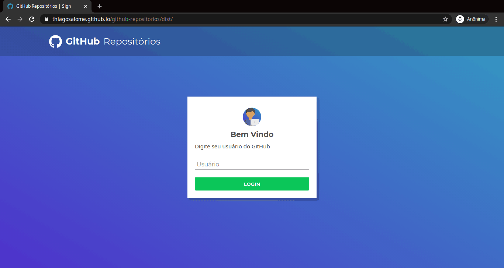

<!-- Logo -->
<p align="center">
  
</p>

<!-- Badges -->
<p align="center">
  <a href="https://thiagosalome.github.io/github-repositorios/dist/" target="_blank">
  
  
  
  
</p>

<!-- Indice-->
<p align="center">
 <a href="#computer-sobre">Sobre</a> •
 <a href="#gear-funcionalidades">Funcionalidades</a> •
 <a href="#wrench-tecnologias-utilizadas">Tecnologias</a> •
 <a href="#movie_camera-preview">Preview</a> •
 <a href="#rocket-executando-o-projeto">Executando</a> •
 <a href="#memo-licença">Licença</a>
</p>

## :computer: Sobre

O **GitHub Repositórios** foi criado para eu praticar meus conhecimentos em Pug, Sass, e Webpack, além de interagir com a API do GitHub.

## :gear: Funcionalidades

- [x] Login na aplicação através do usuário do Github
- [x] Possibilidade de ver todos os repositórios criados pelo usuário
- [x] Possibilidade de buscar novos repositórios
- [x] Possibilidade de salvar e remover respositórios da área favoritos
- [x] Usuário quando logado é armazenado em Local Storage

## :wrench: Tecnologias Utilizadas

<table>
  <tbody>
    <tr>
      <td align="center">
        
        <p>Pug</p>
      </td>
      <td align="center">
        
        <p>SASS</p>
      </td>
      <td align="center">
        
        <p>Javascript</p>
      </td>
      <td align="center">
        
        <p>Webpack</p>
      </td>
    </tr>
  </tbody>
</table>

## :movie_camera: Preview

### Web Desktop



### Web Mobile


## :rocket: Executando o projeto

### Pré-requisitos

Para executar o projeto é necessário ter instalado as seguintes ferramentas:

<table>
  <tbody>
    <tr>
      <td align="center">
        <a href='https://git-scm.com/downloads' target='_blank'>
          
          <p>GIT</p>
        </a>
      </td>
      <td>
        <a href='https://git-scm.com/downloads' target='_blank'>
          
          <p>Node.js</p>
        </a>
      </td>
    </tr>
  </tbody>
</table>

### Rodando aplicação web

```bash
# Clone este repositório
$ git clone https://github.com/thiagosalome/github-repositorios

# Acesse a pasta do projeto no seu terminal/cmd
$ cd github-repositorios

# Instale as dependências
$ npm install

# Execute a aplicação em modo de desenvolvimento
$ npm run dev

# A aplicação será aberta na porta:3000 - acesse http://localhost:3000
```

## :memo: Licença

Este projeto esta sobe a licença [MIT](./LICENCE).
